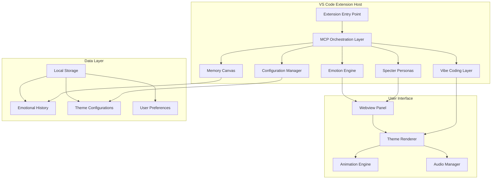
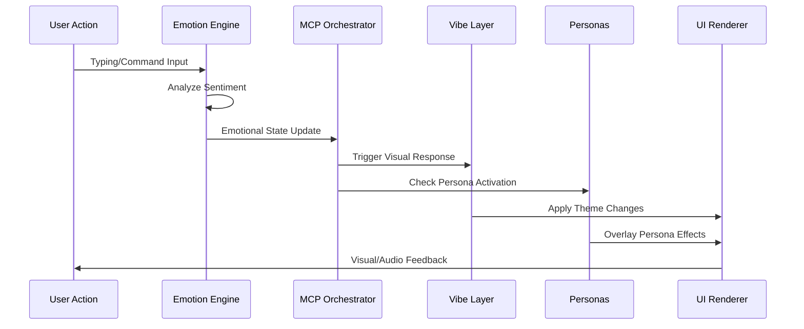

# MirrorCanvas Design Document

## Overview

MirrorCanvas is architected as a modular VS Code extension that creates an emotionally responsive development environment. The system consists of six primary components working in concert: the Emotion Engine for sentiment analysis, the Vibe Coding Layer for visual/audio feedback, the Memory Canvas for persistent emotional history, Specter Personas for AI interactions, the MCP Orchestration layer for system coordination, and the Configuration Manager for user customization.

The extension operates through a reactive architecture where user actions trigger emotional analysis, which then cascades through the visual and audio systems to create an immersive, living workspace experience.

## Architecture

### High-Level System Architecture



### Component Interaction Flow



## Components and Interfaces

### 1. Emotion Engine

**Purpose**: Core sentiment analysis and emotional state management

**Key Interfaces**:
```typescript
interface EmotionEngine {
  analyzeText(input: string): EmotionalVector;
  analyzeBehavior(actions: UserAction[]): EmotionalVector;
  updateEmotionalState(vector: EmotionalVector): void;
  getCurrentState(): EmotionalState;
  getEmotionalHistory(timeRange: TimeRange): EmotionalHistory;
}

interface EmotionalVector {
  calm: number;      // 0-1 scale
  tense: number;     // 0-1 scale
  curious: number;   // 0-1 scale
  excited: number;   // 0-1 scale
  frustrated: number; // 0-1 scale
  timestamp: Date;
}
```

**Implementation Strategy**:
- Integrates with HuggingFace sentiment analysis models for text processing
- Implements behavioral pattern recognition for typing rhythm and code churn analysis
- Uses weighted moving averages to smooth emotional transitions
- Maintains circular buffer of recent emotional states for trend analysis

### 2. Vibe Coding Layer

**Purpose**: Real-time visual and audio feedback system

**Key Interfaces**:
```typescript
interface VibeCodingLayer {
  applyTheme(theme: ThemeSpec): void;
  triggerAnimation(action: UserAction, emotion: EmotionalState): void;
  updateAmbientEffects(emotion: EmotionalState): void;
  playSound(soundEvent: SoundEvent): void;
}

interface ThemeSpec {
  name: string;
  palette: ColorPalette;
  effects: VisualEffects;
  sounds: SoundLibrary;
  animations: AnimationSet;
}
```

**Implementation Strategy**:
- Uses CSS custom properties for dynamic color theming
- Implements Canvas API for particle systems and complex animations
- Integrates Web Audio API for spatial audio effects
- Employs requestAnimationFrame for smooth 60fps animations

### 3. Memory Canvas

**Purpose**: Persistent emotional history and long-term visual evolution

**Key Interfaces**:
```typescript
interface MemoryCanvas {
  storeSession(session: EmotionalSession): void;
  getEmotionalTrends(period: TimePeriod): EmotionalTrends;
  generateBackgroundEvolution(): VisualEvolution;
  applyHistoricalInfluence(currentTheme: ThemeSpec): ThemeSpec;
}

interface EmotionalSession {
  sessionId: string;
  startTime: Date;
  endTime: Date;
  emotionalJourney: EmotionalVector[];
  dominantMood: EmotionalState;
  productivityMetrics: ProductivityData;
}
```

**Implementation Strategy**:
- Uses SQLite for local emotional history storage
- Implements trend analysis algorithms for pattern recognition
- Generates procedural background textures based on emotional patterns
- Applies historical weighting to current visual states

### 4. Specter Personas

**Purpose**: AI agents that provide contextual interactions based on emotional state

**Key Interfaces**:
```typescript
interface SpecterPersonas {
  checkActivationTriggers(emotion: EmotionalState): PersonaActivation[];
  activatePersona(persona: PersonaType, context: InteractionContext): void;
  generatePersonaResponse(persona: PersonaType, situation: string): PersonaResponse;
  deactivatePersona(persona: PersonaType): void;
}

interface PersonaResponse {
  visualOverlay: VisualEffect;
  audioEffect: SoundEffect;
  textMessage?: string;
  actionSuggestion?: ActionSuggestion;
}
```

**Implementation Strategy**:
- Implements rule-based activation system with emotional thresholds
- Uses template-based response generation with contextual variables
- Integrates with Kiro's agent system for advanced AI interactions
- Provides visual overlay system for persona manifestations

### 5. MCP Orchestration Layer

**Purpose**: Coordinates all system components and manages state synchronization

**Key Interfaces**:
```typescript
interface MCPOrchestrator {
  registerComponent(component: SystemComponent): void;
  broadcastStateChange(state: SystemState): void;
  handleUserAction(action: UserAction): void;
  synchronizeComponents(): void;
}

interface SystemState {
  currentEmotion: EmotionalState;
  activeTheme: ThemeSpec;
  activePersonas: PersonaType[];
  userPreferences: UserConfig;
}
```

**Implementation Strategy**:
- Implements event-driven architecture with pub/sub pattern
- Uses Kiro MCP for cross-component communication
- Maintains centralized state management with immutable updates
- Provides conflict resolution for competing system demands

### 6. Configuration Manager

**Purpose**: Handles user customization and theme management

**Key Interfaces**:
```typescript
interface ConfigurationManager {
  loadUserConfig(): UserConfig;
  saveUserConfig(config: UserConfig): void;
  loadTheme(themeName: string): ThemeSpec;
  saveCustomTheme(theme: ThemeSpec): void;
  validateThemeSpec(theme: ThemeSpec): ValidationResult;
}
```

## Data Models

### Core Data Structures

```typescript
// Emotional State Model
interface EmotionalState {
  primary: EmotionType;
  intensity: number; // 0-1 scale
  stability: number; // how consistent the emotion is
  trend: 'rising' | 'falling' | 'stable';
  confidence: number; // analysis confidence level
}

// Theme Specification Model
interface ThemeSpec {
  metadata: {
    name: string;
    version: string;
    author: string;
    description: string;
  };
  visual: {
    palette: {
      primary: string;
      secondary: string;
      accent: string;
      background: string[];
    };
    effects: {
      particleDensity: number;
      animationSpeed: number;
      glowIntensity: number;
      transitionDuration: number;
    };
  };
  audio: {
    ambientLoop: string;
    actionSounds: Record<string, string>;
    volume: number;
  };
}

// User Action Model
interface UserAction {
  type: 'typing' | 'save' | 'compile' | 'error' | 'hover' | 'click';
  timestamp: Date;
  context: {
    fileType?: string;
    errorCount?: number;
    typingSpeed?: number;
    sessionDuration?: number;
  };
}
```

## Error Handling

### Error Categories and Strategies

1. **Sentiment Analysis Failures**
   - Fallback to neutral emotional state
   - Log analysis errors for debugging
   - Graceful degradation to basic visual themes

2. **Animation Performance Issues**
   - Automatic quality reduction based on frame rate monitoring
   - Option to disable resource-intensive effects
   - Fallback to CSS-only animations

3. **Audio System Failures**
   - Silent operation mode when audio context fails
   - User notification of audio issues
   - Preference to disable audio entirely

4. **Theme Loading Errors**
   - Validation of theme specifications before loading
   - Fallback to default theme on corruption
   - User notification of theme issues

5. **Storage Failures**
   - In-memory fallback for session data
   - Periodic backup attempts
   - User notification of persistence issues

### Error Recovery Mechanisms

```typescript
interface ErrorRecovery {
  handleEmotionEngineFailure(): void;
  handleThemeLoadFailure(themeName: string): void;
  handleAnimationPerformanceIssue(): void;
  handleStorageFailure(): void;
  reportError(error: SystemError): void;
}
```

## Testing Strategy

### Unit Testing Approach

1. **Emotion Engine Testing**
   - Mock sentiment analysis responses
   - Test emotional state transitions
   - Validate emotional vector calculations
   - Test behavioral pattern recognition

2. **Vibe Layer Testing**
   - Mock animation triggers
   - Test theme application logic
   - Validate audio event handling
   - Test performance under load

3. **Memory Canvas Testing**
   - Test data persistence and retrieval
   - Validate trend analysis algorithms
   - Test background evolution generation
   - Mock storage layer interactions

### Integration Testing Strategy

1. **Component Interaction Testing**
   - Test MCP orchestration workflows
   - Validate state synchronization
   - Test persona activation chains
   - Verify theme switching processes

2. **Performance Testing**
   - Animation frame rate monitoring
   - Memory usage profiling
   - Storage operation benchmarking
   - Audio latency measurement

3. **User Experience Testing**
   - Emotional response accuracy validation
   - Theme transition smoothness testing
   - Persona interaction quality assessment
   - Configuration persistence verification

### End-to-End Testing Scenarios

1. **Complete Emotional Journey**
   - Simulate full coding session with emotional changes
   - Verify visual evolution matches emotional patterns
   - Test persona activations and deactivations
   - Validate memory persistence across sessions

2. **Theme Customization Workflow**
   - Test custom theme creation and loading
   - Verify theme validation and error handling
   - Test theme sharing and import functionality
   - Validate configuration persistence

3. **Performance Under Stress**
   - Test with multiple simultaneous animations
   - Verify graceful degradation under resource constraints
   - Test recovery from system errors
   - Validate memory cleanup and garbage collection